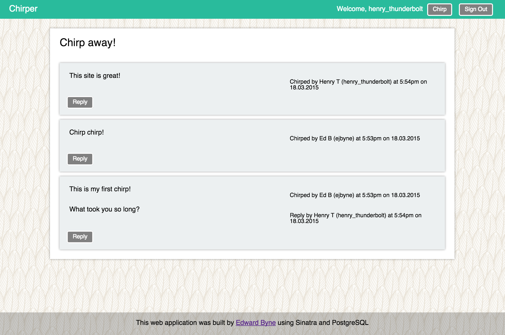

# Chirper

## Summary

Our Week 4 challenge at Makers Academy was to build a basic Twitter clone using Sinatra.

This was a good exercise to consolidate what we had learned in the [Bookmark Manager](https://github.com/ejbyne/bookmark-manager) project, in particular using PostgreSQL and integrating the database into the application using the DataMapper ORM, as well as getting to grips with sessions and user authentication.

I used Cucumber and Capybara to create feature tests, together with RSpec for unit testing the models.

## Technologies used

- Ruby
- Sinatra
- PostgreSQL
- DataMapper
- Bcrypt
- RSpec
- Cucumber
- Capybara
- HTML
- CSS

## Features

- Users sign up to Chirper with their email, password and a username
- The username and email are unique
- Chirps have the name of the user and their user handle
- Use Bcrypt to secure the passwords
- Use DataMapper and PostgreSQL to save the data
- Users don't have to be logged in to see the chirps
- Show chirps in chronological order
- Users can only chirp if they are logged in
- Users can start a conversation by replying to a peep from another user
- Users can only reply to a chirp if they are logged in
- Shows the time and date of each chirp/reply

## To do list
- Allow users to follow each other and view tweets specifically from those users they are following
- Add password reset functionality (as per [Bookmark Manager](https://github.com/ejbyne/bookmark-manager) project)
- Work on the CSS to make it look good

## Screenshot

